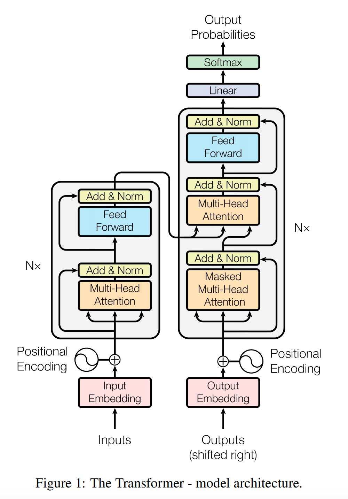

# Transformer模型架构

以自注意力机制为核心，整体分为两大模块：Encoder 编码器、Decoder 解码器，均由多层相同结构堆叠而成；输入统一增加词嵌入 + 位置编码。

---

### <strong>1. 核心原理：自注意力机制</strong>

#### <strong>1.1 请详细解释一下 Transformer 模型中的自注意力机制是如何工作的？它为什么比 RNN 更适合处理长序列？</strong>


* <strong>参考答案：</strong>
    自注意力（Self-Attention）机制是Transformer模型的核心，它使得模型能够动态地衡量输入序列中不同单词之间的重要性，并据此生成每个单词的上下文感知表示。

    <strong>工作原理如下：</strong>

    1.  <strong>生成Q, K, V向量：</strong> 对于输入序列中的每一个词元（token）的嵌入向量，我们通过乘以三个可学习的权重矩阵 $W^Q, W^K, W^V$ ，分别生成三个向量：查询向量（Query, Q）、键向量（Key, K）和值向量（Value, V）。
        * <strong>Query (Q):</strong> 代表当前词元为了更好地理解自己，需要去“查询”序列中其他词元的信息。
        * <strong>Key (K):</strong> 代表序列中每个词元所“携带”的，可以被查询的信息标签。
        * <strong>Value (V):</strong> 代表序列中每个词元实际包含的深层含义。

    2.  <strong>计算注意力分数：</strong> 为了确定当前词元（由Q代表）应该对其他所有词元（由K代表）投入多少关注，我们计算当前词元的Q与其他所有词元的K的点积。这个分数衡量了两者之间的相关性。
        <div align="center">
        $$\text{Score}(Q_i, K_j) = Q_i \cdot K_j$$
        </div>

    3.  <strong>缩放（Scaling）：</strong> 将计算出的分数除以一个缩放因子 $\sqrt{d_k}$（ $d_k$ 是K向量的维度）。这一步是为了在反向传播时获得更稳定的梯度，防止点积结果过大导致Softmax函数进入饱和区。
        <div align="center">
        $$\frac{Q \cdot K^T}{\sqrt{d_k}}$$
        </div>

    4.  <strong>Softmax归一化：</strong> 将缩放后的分数通过一个Softmax函数，使其转换为一组总和为1的概率分布。这些概率就是“注意力权重”，表示在当前位置，每个输入词元所占的重要性。
        <div align="center">
        $$\text{AttentionWeights} = \text{softmax}\left(\frac{Q K^T}{\sqrt{d_k}}\right)$$
        </div>

    5.  <strong>加权求和：</strong> 最后，将得到的注意力权重与每个词元对应的V向量相乘并求和，得到最终的自注意力层输出。这个输出向量融合了整个序列的上下文信息，且权重由模型动态学习得到。
        <div align="center">
        $$\text{Output} = \text{AttentionWeights} \cdot V$$
        </div>

    <strong>为什么比RNN更适合处理长序列？</strong>

    1.  <strong>并行计算能力：</strong> 自注意力机制在计算时，可以一次性处理整个序列，计算所有位置之间的关联，是高度并行的。而RNN（包括LSTM、GRU）必须按照时间顺序依次处理每个词元，无法并行化，导致处理长序列时速度非常慢。
    2.  <strong>解决长距离依赖问题：</strong> 在自注意力中，任意两个位置之间的交互路径长度都是O(1)，因为可以直接计算它们的注意力分数。而在RNN中，序列首尾两个词元的信息传递需要经过整个序列的长度，路径为O(N)，这极易导致梯度消失或梯度爆炸，使得模型难以捕捉长距离的依赖关系。

---

#### <strong>1.2 多头注意力（Multi-Head Attention）</strong>

   
* <strong>参考答案：</strong>
    为突破单路注意力特征提取单一短板，Transformer引入多头注意力机制（Multi-Head Attention）。

    其核心逻辑并非简单拆分输入向量，而是将Q、K、V三组矩阵同步线性投影拆解为多组独立特征子空间，每个注意力头各司其职、并行独立完成全域自注意力计算，最后拼接所有多头输出特征，搭配线性层完成跨头特征融合补强。

    这种精细化并行设计，可同步抓取语法语序、语义关联、指代呼应、逻辑关联等多维度隐性特征，全方位强化模型上下文理解、语义建模综合能力，适配复杂场景文本解析与生成需求。
---

#### <strong>1.3 什么是位置编码？在 Transformer 中，为什么它是必需的？请列举至少两种实现方式。</strong>

   
* <strong>参考答案：</strong>
    <strong>什么是位置编码？</strong>
    位置编码（Positional Encoding, PE）是一个与词嵌入维度相同的向量，其目的是向模型注入关于词元在输入序列中绝对或相对位置的信息。它会与词元的词嵌入（Token Embedding）相加，然后一同输入到Transformer的底层。

    <strong>为什么它是必需的？</strong>
    Transformer的核心机制——自注意力，在计算时处理的是一个集合（Set）而非序列（Sequence）。它本身不包含任何关于词元顺序的信息，是 <strong>置换不变（Permutation-invariant）</strong> 的。这意味着，如果打乱输入序列中词元的顺序，自注意力层的输出也会相应地被打乱，但每个词元自身的输出向量（在不考虑softmax归一化的情况下）是相同的。这显然不符合自然语言的特性，因为语序至关重要（例如“我打你”和“你打我”含义完全相反）。因此，必须通过一种外部机制，将位置信息显式地提供给模型，这就是位置编码的作用。

    <strong>至少两种实现方式：</strong>

    1.  <strong>正弦/余弦位置编码（Sinusoidal Positional Encoding）：</strong>
        这是原始Transformer论文《Attention Is All You Need》中使用的方法。它使用不同频率的正弦和余弦函数来生成位置编码，其公式如下：
        <div align="center">
        $$PE_{(pos, 2i)} = \sin(pos / 10000^{2i/d_{\text{model}}})$$
        </div>

        <div align="center">
        $$PE_{(pos, 2i+1)} = \cos(pos / 10000^{2i/d_{\text{model}}})$$
        </div>

        其中， $pos$ 是词元在序列中的位置， $i$ 是编码向量中的维度索引， $d_{\text{model}}$ 是嵌入维度。
        * <strong>优点：</strong>
            * <strong>可外推性：</strong> 能够处理比训练中最长序列还要长的序列。
            * <strong>相对位置信息：</strong> 模型可以轻易地学习到相对位置关系，因为对于任何固定的偏移量 $k$ ， $PE_{pos+k}$ 都可以表示为 $PE_{pos}$ 的一个线性函数，这使得模型更容易捕捉相对位置的依赖。

    2.  <strong>可学习的绝对位置编码（Learned Absolute Positional Encoding）：</strong>
        这种方法将位置编码视为模型参数的一部分，通过训练学习得到。具体来说，会创建一个形状为 `(max_sequence_length, embedding_dimension)` 的位置编码矩阵。在处理序列时，根据每个词元的位置索引，从这个矩阵中查找对应的编码向量，并加到词嵌入上。BERT和GPT-2等模型采用了这种方式。
        * <strong>优点：</strong> 模式更加灵活，可以让模型自己学习出最适合数据的位置表示。
        * <strong>缺点：</strong> 无法泛化到超过预设 `max_sequence_length` 的长度。如果需要处理更长的序列，就需要对位置编码进行微调或采用其他策略。

---

### <strong>2. 模型架构</strong>


* <strong>注意：</strong>
    以机器翻译举例：
    ```
    Encoder + Decoder 完整流程示例（Transformer 机器翻译场景）
    任务：中文输入 我爱猫 → 英文输出 I love cats
    基础参数
    输入词表：我 / 爱 / 猫
    输出词表：I/love/cats/<start>/<end>
    一、Encoder 编码器流程（只处理源文本：我爱猫）
    Encoder 堆叠 N 层，每层结构完全一样：
    词嵌入 → 位置编码 → 多头自注意力（Self-Attn）→ Add&Norm → FFN → Add&Norm

    步骤 1：输入预处理
    分词：[我, 爱, 猫]
    词编码转向量 + 加上位置编码，得到输入矩阵 
 
    步骤 2：多头自注意力（Encoder 自注意力：只看自身输入）
    用权重矩阵把 X映射出 Q,K,V（全部来自输入 X），缩放,softmax 归一化权重，乘 V 得到注意力输出
    残差连接：输入 + 注意力结果，层归一化 Norm

    步骤 3：前馈网络 FFN
    两层线性变换 + 激活，再残差 + Norm

    步骤 4：Encoder 输出
    最终得到记忆矩阵 Memory
    含义：把整句中文全部编码成全局上下文信息，后面给 Decoder 使用

    二、Decoder 解码器流程（生成英文：I love cats）
    Decoder 每层 3 个模块，顺序：
    掩码自注意力 → Add&Norm → 交叉注意力 → Add&Norm → FFN → Add&Norm
    Decoder 是逐词生成，一次只输出一个单词，循环直到输出 <end>
    初始状态
    解码器输入开头标志：start>

    第 1 轮：输入 <start>，预测第一个词 I
    模块 1：掩码多头自注意力（Masked Self-Attention）
    输入：<start> 的向量
    掩码作用：生成时看不到未来未生成的单词，防止提前偷看后面文字,避免利用答案本身来预测答案
    Q/K/V 全部来自 Decoder 当前已输出序列
    模块 2：交叉注意力 Cross-Attention（Encoder-Decoder Attention）
    Q：来自 Decoder 上一层输出（当前生成的词向量）
    K、V：全部来自 Encoder 输出的 Memory（中文整句上下文）
    作用：生成每个英文单词时，对应去匹配中文里相关语义
    模块 3：FFN + Norm，最后线性 + softmax 预测词汇
    本轮输出概率最高单词：I

    第 2 轮：Decoder 输入序列 <start>, I，预测 love
    掩码自注意力：<start> 只能看自己，I 能看 <start> 和自己，看不到未来词
    交叉注意力：拿当前 <start>,I 的 Q，去匹配中文记忆 我、爱、猫，匹配到 “爱” 的语义
    预测输出：love

    第 3 轮：输入 <start>, I, love，预测 cats
    交叉注意力匹配中文 “猫”，输出 cats
    
    第 4 轮：输入 <start>, I, love, cats，预测 <end>
    出现结束符，生成终止，完整句子：I love cats
    ```


---

#### <strong>2.1 左侧 Encoder 编码器流程（原文输入处理）</strong>

* <strong>参考答案：</strong>
    作用：对完整输入文本做双向全局语义编码，输出上下文特征，供给 Decoder 做交叉注意力。
    1. Inputs 原始输入文本：文本分词得到 Token 序列。
    2. Input Embedding 输入词嵌入：将离散 Token 映射为维稠密向量。
    3. Positional Encoding 位置编码：正弦余弦位置向量与嵌入向量逐元素相加，注入语序信息（自注意力无时序感知能力）。
    4. N 层堆叠 Encoder 单层内部顺序（每层 2 个子层，均带残差 Add & Norm），每层固定流程：
        多头自注意力 Multi-Head Attention：无掩码，建模全局 token 之间的关联；
        Add & Norm：残差连接（输入直接加到注意力输出）+ 层归一化（Layer Norm），训练保障工具，残差通路防止梯度消失，归一稳定训练；；
        前馈网络 Feed Forward：给每个 token 单独做非线性语义强化，补足注意力缺少的非线性表达。；
        Add & Norm：第二次残差归一化，作为本层输出送入下一层 Encoder。
        Encoder 最终输出：完整原文上下文特征，作为 Decoder 交叉注意力的 K、V 输入。
---

#### <strong>2.2 右侧 Decoder 解码器流程（目标序列生成，重点讲输出链路）</strong>
* <strong>参考答案：</strong>
    作用：Decoder 输入是右移后的目标序列 Outputs (shifted right)，例如翻译任务：目标句<Start> + 已生成单词，避免模型提前看到末尾 Token。
    1. Decoder 底层输入预处理:
        * Outputs (shifted right)：右移目标 Token 序列；
        * Output Embedding：目标词嵌入；
        * Positional Encoding：同样叠加位置编码，和 Encoder 预处理逻辑一致。
    2. N 层堆叠 Decoder 单层内部顺序（每层 3 个子层，全部带 Add & Norm 残差归一）
        * 每层从上到下执行：
        * Masked Multi-Head Attention 掩码多头自注意力：下三角掩码，生成第 i 个词时只能看见前 1∼i个词，防止信息泄露；输出经过 Add & Norm。
        * Multi-Head Attention 交叉注意力 Cross-Attention（图中第二层橙色块）
        * Q：上一层 Masked 注意力的输出（当前已生成文本特征）
        * K、V：左侧 Encoder 的最终输出（完整原文语义）
        * 作用：让当前生成的单词对齐输入原文的语义，是机器翻译、摘要等 Seq2Seq 任务的核心对齐模块；输出再走 Add & Norm。
    3. Feed Forward 前馈网络
        * 和 Encoder FFN 结构完全相同，逐 Token 非线性特征变换；输出经过 Add & Norm，作为本层 Decoder 输出送入下一层。    
---

#### <strong>2.3 顶层输出链路（图最上方，完整生成流程）</strong>
* <strong>参考答案：</strong>
    作用：所有N层 Decoder 堆叠完成后，最后一层 Decoder 输出向上流入输出分支：
    1. Linear 线性层将 维模型隐向量，映射到词表总维度 V，得到每个词汇的原始得分 logits。
    2. Softmax 归一化层 对 logits 做指数归一化，输出 Output Probabilities 输出概率分布：向量长度等于词表大小；
        每个位置数值 ∈ [0,1]，所有权重总和 = 1，代表当前位置生成对应单词的概率。
    3. 最终输出使用逻辑（图中未画出的推理步骤）
        训练阶段：用该概率分布与真实目标 Token 计算交叉熵损失，反向传播更新模型；
        推理生成阶段：取概率最大的 Token（贪心解码），或采样 / 束搜索选出合适单词，将该单词追加到 Decoder 输入，右移后再次送入 Decoder 循环生成，直到输出终止符<EOS>。
---
